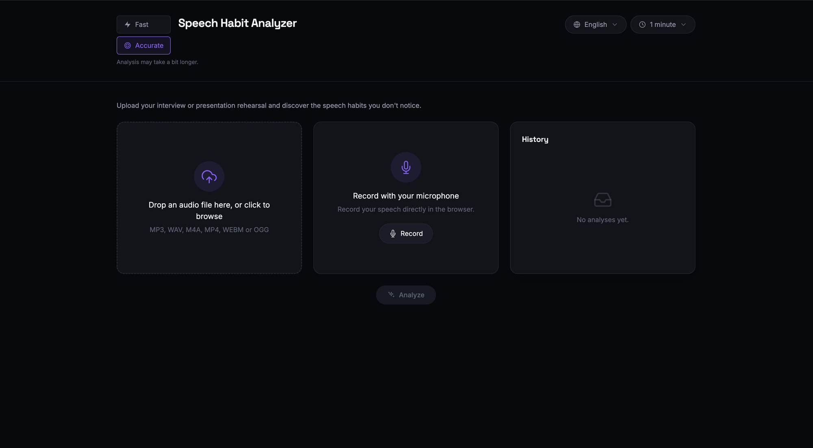
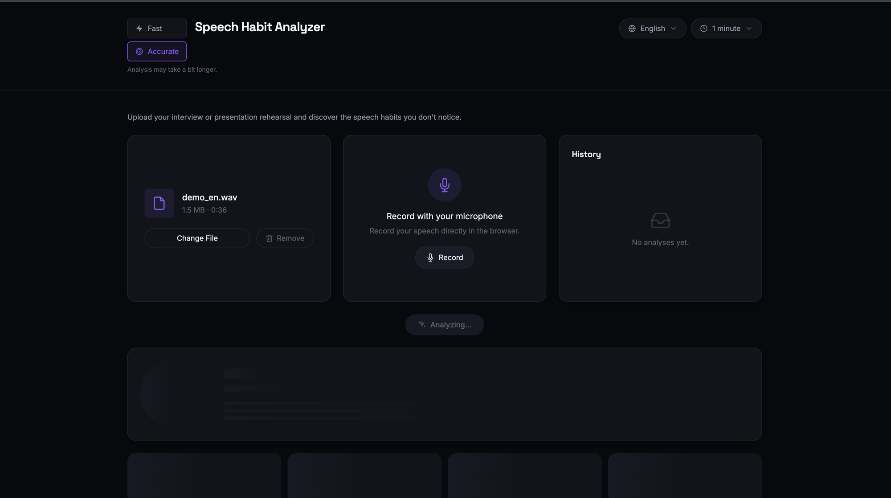
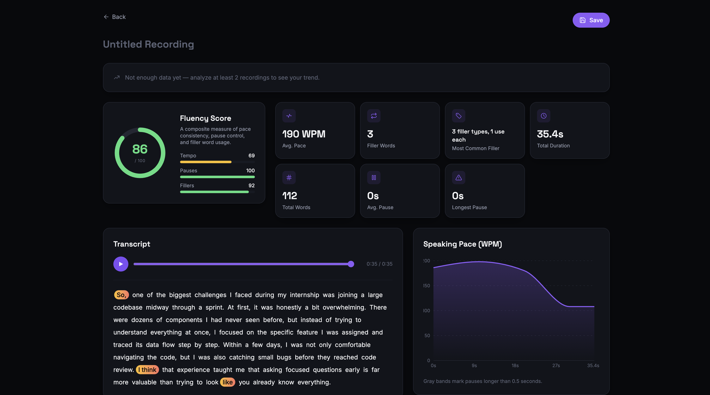
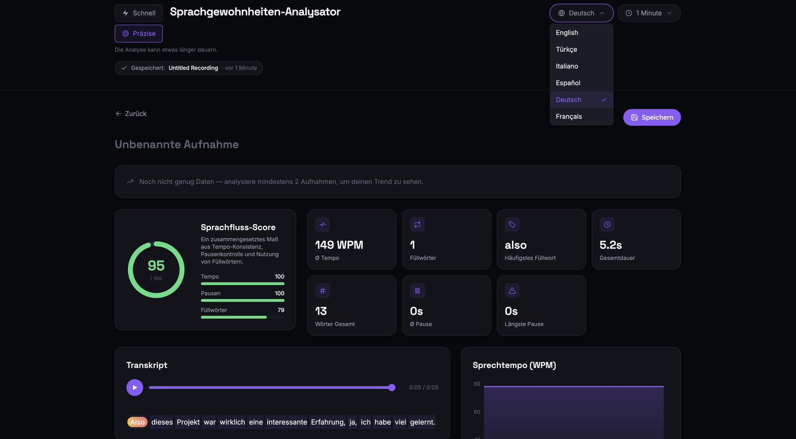
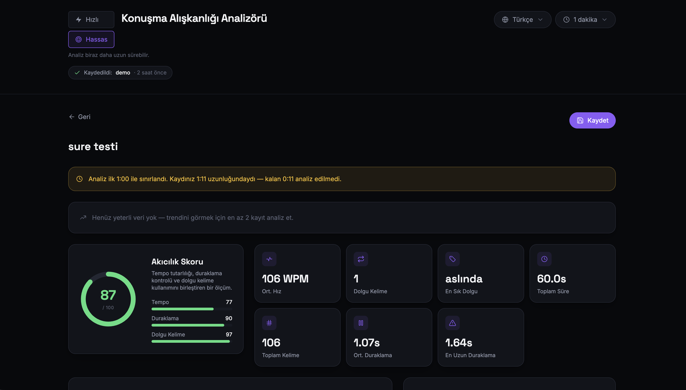

# Speech Habit Analyzer

Discover the speech habits you don't notice — filler words, pacing, and pauses, analyzed locally on your Mac.

Speech Habit Analyzer is a web app for rehearsing interviews and presentations. Upload a recording or record straight from the browser, pick the language you're speaking, and get a personalized report — filler word usage, speaking pace, pause patterns, and a composite Fluency Score — generated entirely with plain Python, with no LLM involved and nothing sent to a third-party API. Every analysis is saved locally, so you can track how your Fluency Score changes over time and replay past recordings with the transcript synced to playback.

## Features

- **Filler word detection** — flags filler words and multi-word filler phrases (e.g. "you know", "en fait quoi") directly in the transcript, grouped as single highlights
- **Pause analysis** — detects and visualizes pauses longer than 0.5 seconds on the speaking-pace timeline
- **Speaking pace chart** — words-per-minute over time, so you can see where you sped up or dragged
- **Fluency Score** — a single 0–100 score combining pace consistency, pause regularity, and filler word density
- **Two ways in** — drag-and-drop file upload or in-browser microphone recording, each with its own preview step before you commit to analyzing
- **Live recording feedback** — a real-time audio level meter and timer while recording, plus a listen-back-before-you-commit preview with discard/retry
- **History & progress tracking** — every saved analysis is archived locally; a progress chart plots your Fluency Score trend over time
- **Synced playback** — click any word in the transcript to jump the audio to that moment; the active word highlights as it plays
- **6 languages** — Turkish, English, Italian, Spanish, German, and French, each with its own filler word list and UI translation

## Language Support

| Language | Code | Filler Phrases Tracked | Example Filler Words |
|----------|------|:-----------------------:|-----------------------|
| Turkish  | `tr` | 21 | "yani", "şey", "falan", "aslında" |
| English  | `en` | 20 | "um", "uh", "like", "you know" |
| Italian  | `it` | 16 | "cioè", "tipo", "allora", "insomma" |
| Spanish  | `es` | 16 | "o sea", "bueno", "pues", "tipo" |
| German   | `de` | 16 | "äh", "also", "halt", "irgendwie" |
| French   | `fr` | 20 | "euh", "genre", "donc", "voilà" |

## Architecture

```
┌──────────────┐   POST /analyze (audio + language)   ┌──────────────┐   word-level transcript   ┌──────────────────┐
│   Frontend   │ ────────────────────────────────────▶ │   Backend    │ ─────────────────────────▶ │    mlx-whisper    │
│ React + Vite │                                        │   FastAPI    │                             │  (Apple Silicon)  │
│              │ ◀──────────────────────────────────── │              │ ◀───────────────────────── │                    │
└──────────────┘             JSON analysis              └──────┬───────┘                             └────────────────────┘
                                                                 │
                                                                 ▼
                                                          ┌──────────────┐
                                                          │    SQLite    │
                                                          │  (history &  │
                                                          │  recordings) │
                                                          └──────────────┘
```

**Stack:** FastAPI · mlx-whisper · ffmpeg · SQLite (backend) — React 19 · Vite · Tailwind CSS · Recharts (frontend)

## Setup

### Clone

```bash
git clone https://github.com/zeynepg22/speech-habit-analyzer.git
cd speech-habit-analyzer
```

### Prerequisites

- macOS on Apple Silicon (required by mlx-whisper)
- Python 3.10+
- Node.js 18+
- `ffmpeg`

```bash
brew install ffmpeg
```

### Backend

```bash
cd backend
python3 -m venv venv
source venv/bin/activate
pip install -r requirements.txt

uvicorn main:app --reload --port 8000
```

On the first request, the `mlx-community/whisper-small-mlx` model is downloaded automatically from Hugging Face (this can take a few minutes). The SQLite database and `recordings/` directory are created automatically on startup.

Smoke test:

```bash
curl -X POST http://127.0.0.1:8000/analyze \
  -F "file=@sample.wav" \
  -F "language=en"
```

`language` must be one of: `tr`, `en`, `it`, `es`, `de`, `fr`.

### Frontend

```bash
cd frontend
npm install
npm run dev
```

The app opens at `http://localhost:5173` and talks to the backend at `http://127.0.0.1:8000`.

## Usage

1. Pick your speaking language from the dropdown in the header.
2. Get audio one of two ways: drag a file onto the **Upload File** card, or record live with the **Record Audio** card.
3. Click **Analyze**. mlx-whisper transcribes the audio locally with word-level timestamps, and the backend scores it.
4. Review the transcript (filler words highlighted), the pace chart, and your Fluency Score breakdown.
5. Click **Save** to name and archive the analysis, or download the transcript and audio. Past analyses appear in the History panel, with a progress trend once you have two or more.

## About the Score

**Fluency Score (0–100)** combines pace consistency (40%), pause regularity (35%), and filler word density (25%) into a single number. It reflects timing patterns only — not a measurement of pronunciation, stress, or any clinical or psychological state.

## API

- `POST /analyze` — multipart `file` + `language`; transcribes and scores the audio, returns `{id, language, transcript, pace_timeline, pauses, summary}`. Not persisted until saved.
- `POST /history` — persists a previously analyzed recording (id, name, language, result) to history and disk.
- `GET /history` — summary list of saved analyses (id, date, language, key stats), newest first.
- `GET /history/{id}` — full detail for one saved analysis, same shape as `/analyze`'s response.
- `DELETE /history/{id}` — deletes the DB row and the stored audio file.
- `GET /recordings/{id}` — streams a saved recording's audio for playback.
- `GET /tmp-recordings/{id}` — streams a not-yet-saved recording's audio.

## Project Structure

```
/backend
  main.py                FastAPI app: /analyze, /history, /recordings endpoints
  storage.py              SQLite persistence for analyses (backend/data/history.db)
  transcriber.py          mlx-whisper wrapper (ffmpeg conversion + word timestamps)
  analyzer.py              pause / WPM / filler word / fluency score analysis
  filler_words.py          filler word lists per language (tr, en, it, es, de, fr)
  recordings/              persisted audio files, named <uuid>.<ext>
  requirements.txt

/frontend
  src/App.jsx                             top-level state, view switching, analysis flow
  src/i18n.js                             UI translations for the 6 supported languages
  src/views/UploadView.jsx                upload/record cards + history sidebar
  src/views/ResultsView.jsx               results screen: progress chart, score, transcript, pace chart
  src/components/UploadCard.jsx           drag-and-drop upload with file preview (name/size/duration)
  src/components/RecordCard.jsx           in-browser recording: level meter, timer, listen-back preview
  src/components/HistorySidebar.jsx       past-analyses list with delete
  src/components/ProgressTrendChart.jsx   Fluency Score over time
  src/components/AudioPlayer.jsx          playback controls, exposes seekTo() via ref
  src/components/TranscriptView.jsx       transcript + embedded audio player, click-to-seek, active-word highlight
  src/components/FluencyGauge.jsx         circular fluency score gauge + breakdown bars
  src/components/MiniBar.jsx              shared sub-score bar used by FluencyGauge
  src/components/Skeleton.jsx             loading-state placeholder layout
  src/components/PaceChart.jsx            speaking pace timeline (Recharts)
  src/components/SummaryCard.jsx          summary stat cards
  src/components/SaveDialog.jsx           save-to-history / download choice
  src/components/UnsavedChangesDialog.jsx warns before leaving an unsaved analysis
  src/components/SavedBanner.jsx          quick link to the most recently saved analysis
```

## Screenshots

**Upload a file or record straight from the browser.**



**Pick your audio, review it, and hit Analyze.**



**Get a Fluency Score, a synced transcript with filler words highlighted, and a pace chart.**



**Fully translated UI across all 6 supported languages.**



**Set an analysis time limit — if a recording is longer than the selected duration, only that much gets analyzed, and a warning banner tells you so.**


